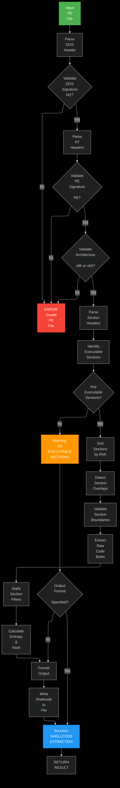

<div align="center">
  <h1>purl diver</h1>
  <p><b>PE SHELLCODE EXTRACTOR</b></p>
  
  
</div>

<div align="center">
  
  
  &nbsp;
  
  &nbsp;
  
  &nbsp;
  
  
</div>

<p align="center">
  <a href="#overview">Overview</a> •
  <a href="#features">Features</a> •
  <a href="#building-and-usage">Usage</a> •
  <a href="#output-formats">Formats</a> •
  <a href="#analysis-features">Analysis</a> •
  <a href="#security">Security</a> •
  <a href="#use-cases">Use Cases</a>
</p>

<hr>

<br>

## OVERVIEW

**purl_diver** is an cross-platform command-line tool for extracting shellcode from PE (Portable Executable) files.


---

**purl_diver**:

1. **PARSES** PE file structure with comprehensive validation
2. **IDENTIFIES** executable sections via `IMAGE_SCN_CNT_CODE` or `IMAGE_SCN_MEM_EXECUTE` flags
3. **EXTRACTS** raw code bytes with overlap detection and boundary checks
4. **OUTPUTS** clean shellcode in multiple formats (binary, C, Python, hex, JSON)

`purl_diver` tool prioritizes `security`, `robustness`, and `portability`, running seamlessly on Windows, Linux, and macOS.

<br>

## BUILDING AND USAGE

### 

- A C compiler (`gcc`, `clang`, or MSVC)
- **Windows:** Visual Studio Build Tools or MinGW-w64
- **Linux:** `build-essential` package
- **macOS:** Xcode Command Line Tools

### BUILDING

**WINDOWS (MSVC):**

```bash
cl extract_shellcode.c /O2 /W4 /EHsc /Fe:extract_shellcode.exe
```

**WINDOWS (MinGW):**

```bash
gcc extract_shellcode.c -o extract_shellcode.exe -O2 -Wall
```

**LINUX:**

```bash
gcc extract_shellcode.c -o extract_shellcode -O2 -Wall
```

**macOS:**

```bash
clang extract_shellcode.c -o extract_shellcode -O2 -Wall
```

### BASIC USAGE

**1. EXTRACT SHELLCODE FROM PE FILE**

```bash
./extract_shellcode payload.exe shellcode.bin
```

**2. ENABLE VERBOSE MODE FOR DETAILED OUTPUT**

```bash
./extract_shellcode -v payload.exe shellcode.bin
```

**3. EXTRACT WITH HASH CALCULATION**

```bash
./extract_shellcode --hash payload.exe shellcode.bin
```

Success output:
```
[+] Success: Extracted 8192 bytes from 3 sections to 'shellcode.bin'.
```

### ADVANCED USAGE EXAMPLES

**EXTRACT SPECIFIC SECTION:**

```bash
./extract_shellcode --section .text payload.exe output.bin
```

**EXCLUDE RESOURCE SECTION:**

```bash
./extract_shellcode --exclude .rsrc payload.exe output.bin
```

**DRY RUN (ANALYZE WITHOUT EXTRACTING):**

```bash
./extract_shellcode --dry-run payload.exe
```

**INTERACTIVE SECTION SELECTION:**

```bash
./extract_shellcode --interactive payload.exe output.bin
```

**BATCH PROCESSING:**

```bash
./extract_shellcode --batch --output-dir ./extracted samples/*.exe
```

### INSPECTING OUTPUT

View extracted shellcode in hexadecimal:

```bash
xxd output.bin
# or
hexdump -C output.bin
```

<br>

## FEATURES

<table>
<tr>
<td width="50%">

### CAPABILITIES

- **Cross-platform compatibility** (Windows, Linux, macOS)
- **x86/x64 architecture support**
- **Intelligent section detection** via PE characteristics
- **Overlap detection & handling** for malformed files
- **Memory-safe extraction** with two-pass validation
- **Multiple output formats** (binary, C, Python, hex, JSON)
- **Comprehensive PE validation** (DOS, NT, section headers)

</td>
<td width="50%">

### Security & ANALYSIS

- **Integer overflow protection**
- **500MB file size limit** (prevents resource exhaustion)
- **Entry point detection**
- **Entropy analysis** (detect packed/encrypted code)
- **SHA256 hash calculation**
- **Import/Export table analysis**
- **Section boundary validation**

</td>
</tr>
</table>

<br>

## OPTIMIZED ARCHITECTURE

`purl_diver` features an optimized, maintainable codebase with enhanced security and performance:

### OPTIMIZATIONS IMPLEMENTED

| Optimization | Impact | Description |
|--------------|--------|-------------|
| **PE Context Structure** | Performance & Maintainability | Consolidates PE-related data into a single context structure, reducing parameter passing and eliminating redundant calculations |
| **Streaming Hash Functions** | Memory Efficiency | Implements chunked MD5 and SHA-256 algorithms that process data without large memory allocations for padded messages |
| **Optimized Section Parsing** | Performance | Eliminates duplicate string operations in section name parsing with single-pass processing |
| **Memory Management** | Security | Enhanced bounds checking and proper resource cleanup throughout codebase |

### ARCHITECTURE BENEFITS

<table>
<tr>
<td><b>MAINTAINABILITY</b></td>
<td>Structured PE Context design reduces complexity</td>
</tr>
<tr>
<td><b>PERFORMANCE</b></td>
<td>Streaming algorithms reduce memory usage for large files</td>
</tr>
<tr>
<td><b>EXTENSIBILITY</b></td>
<td>Easy to add new formats & features</td>
</tr>
<tr>
<td><b>TESTABILITY</b></td>
<td>Individual component validation</td>
</tr>
<tr>
<td><b>SECURITY</b></td>
<td>Comprehensive bounds & overflow checks</td>
</tr>
</table>

<br>

## OUTPUT FORMATS

`purl_diver` supports multiple output formats for seamless integration:

### FORMAT (DEFAULT)

<details>
<summary><b>Click to expand binary format</b></summary>

Raw binary output - perfect for direct shellcode usage:

```bash
./extract_shellcode payload.exe shellcode.bin
```

</details>

### ARRAY FORMAT

<details>
<summary><b>Click to expand C format</b></summary>

Embed shellcode directly in C source:

```bash
./extract_shellcode -f c payload.exe output.c
```

**Output:**
```c
unsigned char shellcode[] = {
  0x4D, 0x5A, 0x90, 0x00, 0x03, 0x00, 0x00, 0x00, 0x04, 0x00, 0x00, 0x00,
  0xFF, 0xFF, 0x00, 0x00, 0xB8, 0x00, 0x00, 0x00, 0x00, 0x00, 0x00, 0x00,
  // ... more bytes
};
unsigned int shellcode_len = 8192;
```

</details>

### FORMAT

<details>
<summary><b>Click to expand Python format</b></summary>

Generate Python-ready byte strings:

```bash
./extract_shellcode -f python payload.exe output.py
```

**Output:**
```python
shellcode = b"\x4D\x5A\x90\x00\x03\x00\x00\x00\x04\x00\x00\x00\xFF\xFF\x00\x00"
shellcode += b"\xB8\x00\x00\x00\x00\x00\x00\x00\x40\x00\x00\x00\x00\x00\x00\x00"
# ... more bytes
```

</details>

### DUMP FORMAT

<details>
<summary><b>Click to expand hex dump format</b></summary>

Human-readable hex dump with ASCII representation:

```bash
./extract_shellcode -f hex payload.exe output.txt
```

**Output:**
```
00000000: 4D 5A 90 00 03 00 00 00 04 00 00 00 FF FF 00 00  |MZ..............|
00000010: B8 00 00 00 00 00 00 00 40 00 00 00 00 00 00 00  |........@.......|
00000020: 00 00 00 00 00 00 00 00 00 00 00 00 00 00 00 00  |................|
```

</details>

### FORMAT

<details>
<summary><b>Click to expand JSON format</b></summary>

Structured metadata with extraction details:

```bash
./extract_shellcode -f json payload.exe output.json
```

**Output:**
```json
{
  "input_file": "payload.exe",
  "architecture": "x64",
  "file_type": "EXECUTABLE",
  "entry_point_rva": 4096,
  "entry_point_section": ".text",
  "sections_extracted": 2,
  "total_bytes": 8192,
  "total_entropy": 7.92,
  "sha256": "a3f5b8...",
  "sections": [
    {
      "name": ".text",
      "virtual_address": 4096,
      "virtual_size": 4096,
      "raw_data_offset": 1024,
      "raw_data_size": 4096,
      "characteristics": "IMAGE_SCN_CNT_CODE | IMAGE_SCN_MEM_EXECUTE | IMAGE_SCN_MEM_READ",
      "entropy": 7.85
    }
  ]
}
```

</details>

<br>

## ANALYSIS FEATURES

### ENTROPY ANALYSIS

Detect packed or encrypted code sections:

```bash
./extract_shellcode --entropy payload.exe shellcode.bin
```

**Entropy interpretation:**
- **< 5.0** - Low entropy (plain text, uncompressed)
- **5.0 - 7.0** - Normal compiled code
- **> 7.0** - High entropy (packed/encrypted/compressed)

### HASH CALCULATION

Generate SHA256 hash of extracted code with improved memory efficiency:

```bash
./extract_shellcode --hash payload.exe shellcode.bin
```

**Output:**
```
[+] SHA256: a3f5b8c2d1e4f7a9b6c3d0e1f2a5b8c9d2e3f4a7b8c1d2e3f4a5b6c7d8e9f0a1
```

### IMPORT/EXPORT ANALYSIS

Analyze PE dependencies and exports:

```bash
./extract_shellcode --imports payload.exe shellcode.bin
```

**Output:**
```
[+] Import Analysis:
    KERNEL32.dll
      - LoadLibraryA
      - GetProcAddress
      - VirtualAlloc
    USER32.dll
      - MessageBoxA
      
[+] Export Analysis:
    - Function1 (RVA: 0x1000)
    - Function2 (RVA: 0x1050)
```

### INTERACTIVE MODE

Select sections interactively:

```bash
./extract_shellcode --interactive payload.exe output.bin
```

**Output:**
```
[+] Available executable sections:
    [1] .text   (4096 bytes, entropy: 7.85)
    [2] .rdata  (2048 bytes, entropy: 6.42)
    [3] CODE    (1024 bytes, entropy: 7.91)
    
Select sections to extract (e.g., 1,3 or 'all'): 
```

<br>

</details>

### SAFE USAGE PRACTICES

<table>
<tr>
<td><b>ISOLATION</b></td>
<td>Run only in VMs or sandboxed environments</td>
</tr>
<tr>
<td><b>NEVER EXECUTE</b></td>
<td>Do not execute extracted shellcode without analysis</td>
</tr>
<tr>
<td><b>STAY UPDATED</b></td>
<td>Keep tool updated for security patches</td>
</tr>
<tr>
<td><b>DRY RUN FIRST</b></td>
<td>Use <code>--dry-run</code> to analyze before extracting</td>
</tr>
</table>

<br>

## COMMAND-LINE OPTIONS

### OPTIONS

```
-v, --verbose          Enable verbose output mode
--help                 Display usage information and exit
```

### FILTERING

```
-s, --section <name>   Include specific section by name
--exclude <name>       Exclude specific section by name
--min-size <bytes>     Minimum section size to include
```

### OPTIONS

```
-f, --format <format>  Output format (binary, c, python, hex, json)
--dry-run              Analyze only, don't extract
--hash                 Include SHA256 hash of extracted code
--entropy              Include entropy calculation of sections
--imports              Analyze import table
--exports              Analyze export table
```

### OPTIONS

```
--interactive, -i      Enable interactive section selection
--progress             Show progress indicator for large files
--batch                Enable batch processing mode
--output-dir <dir>     Directory for output files (batch mode)
```

<br>

### THE PIPELINE

---

<div align="center">
  
</div>


## TROUBLESHOOTING

### ERRORS AND WARNINGS

<details>
<summary><b>Click to expand troubleshooting guide</b></summary>

#### Failed to open input file"
- Verify file path is correct and file exists
- Ensure you have read permissions for the file

#### Not a valid PE file (Invalid DOS signature)"
- File is not a PE (Windows executable) file
- Check that you're using a Windows EXE or DLL

#### Invalid PE signature"
- File has valid DOS header but missing PE signature
- May indicate corrupted or malformed PE file

#### Unsupported architecture"
- Tool only supports x86 (32-bit) and x64 (64-bit) PE files
- Other architectures are not supported

#### No executable sections found"
- PE file contains no sections marked as executable
- May indicate packed executable or obfuscated code

#### Skipping overlapping section"
- PE file contains overlapping sections
- Often a sign of malformed or malicious file

</details>

### PERFORMANCE TIPS

For large files (>1MB), enable progress indicator:

```bash
./extract_shellcode --progress large_file.exe output.bin
```

For batch processing, use output directory:

```bash
./extract_shellcode --batch --output-dir ./extracted samples/*.exe
```
<br>

## CONTRIBUTING

Contributions are welcome! When contributing:

- Follow secure coding practices
- Include comprehensive bounds checking
- Add appropriate error handling
- Test against various PE formats and edge cases
- Update documentation for new features

<br>

## LICENSE

This project is UNLICENSED

<br>

<div align="center">
  <hr>
  <p><i>mfin' deep divin'!</i></p>
  <p><b>purl_diver</b> - holy diver, you've been down too long in the darkweb seas!</p>
</div>